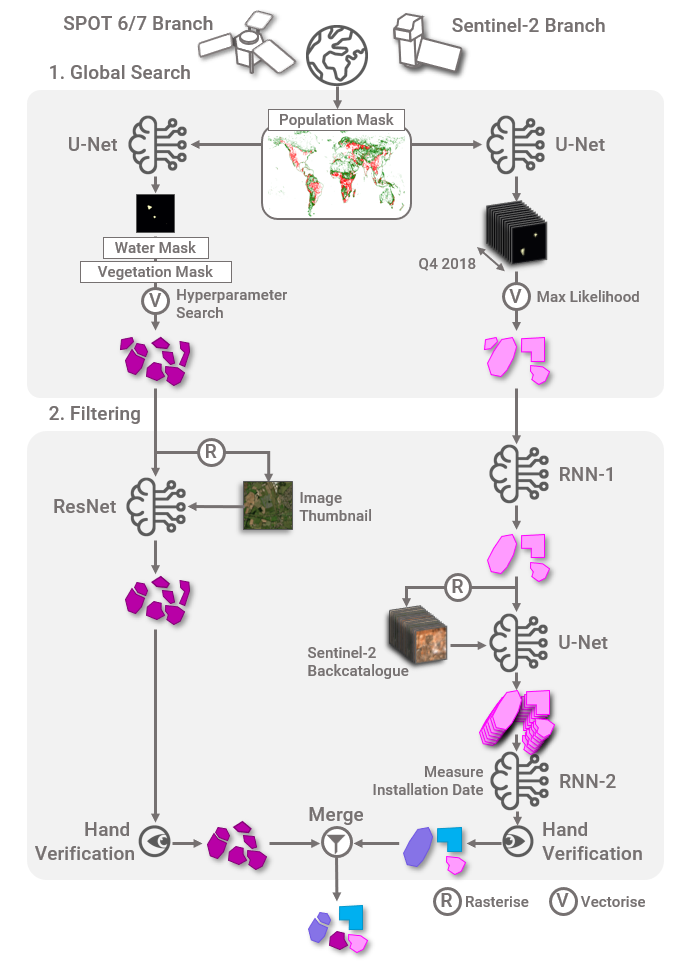
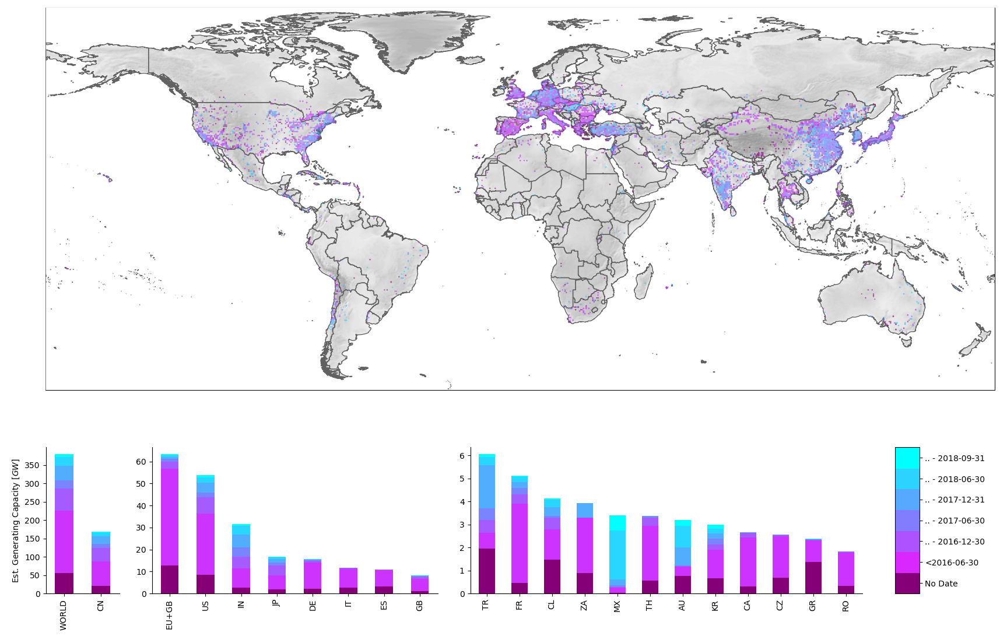
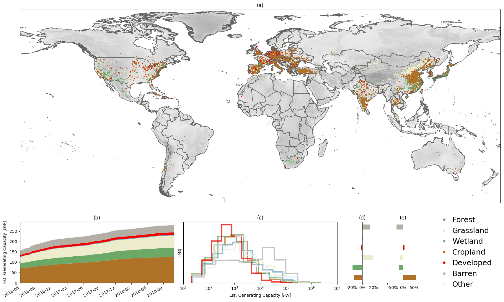
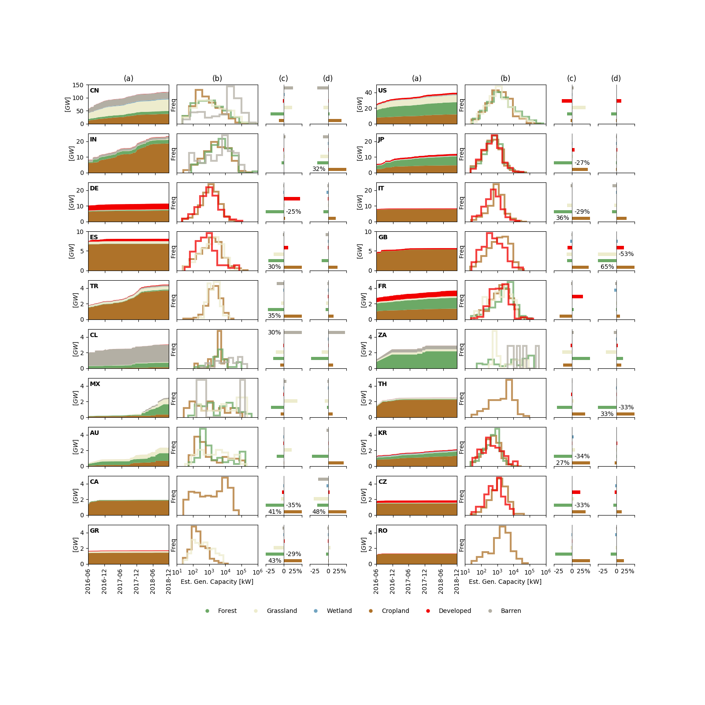

# A Global Inventory of Commerical-, Industrial-, and Utility-Scale Photovoltaic Solar Generating Units
Repository for machine learning and remote sensing pipeline described in [Kruitwagen, L., Story, K., Friedrich, J., Byers, L., Skillman, S., & Hepburn, C. (2021) A global inventory of photovoltaic solar energy generating units, _Nature_ **598**, 604–610](https://www.nature.com/articles/s41586-021-03957-7). 

# Project Summary

## Abstract

Photovoltaic (PV) solar energy generating capacity has grown by 41\% per year since 2009. This rapid deployment of solar energy must continue if climate and Sustainable Development Goals are to be met. Energy system projections that mitigate climate change and facilitate universal energy access  show a nearly ten-fold increase in PV solar energy generating capacity by 2040. Geospatial data describing the energy system is required to manage generation intermittency, mitigate climate change risks, and identify trade-offs with biodiversity, conservation, and land protection priorities caused by the land use and land cover change necessary for PV deployment. Currently available inventories of solar generating capacity cannot fully address these needs. Here, we provide a global inventory of commercial-, industrial-, and utility-scale PV solar energy generation stations (i.e. PV generating stations in excess of 10kW nameplate capacity) using a longitudinal corpus of remote sensing imagery, machine learning, and a large cloud computation infrastructure. We locate and verify 68,661 facilities, an increase of 253\% (in number of facilities) on the previously best-available asset-level data. With the help of a hand-labelled test set, we estimate global installed generating capacity to be 423GW [-75GW, +77GW] at the end of 2018. Enrichment of our dataset with estimates of facility installation date, historic land cover classification, and proximity to protected areas and indigenous and community lands allows us to show that the majority of the PV solar energy facilities are sited on cropland, followed by aridlands and grassland. Our inventory can aid PV delivery aligned with the Sustainable Development Goals.

## Figure Highlights

### Computer Vision with Remote Sensing Imagery to Detect Solar PV

**Figure 1:** We detect utility-scale (>10kW) solar PV facilities with machine learning in Sentinel-2 and SPOT6/7 remote sensing imagery. Here, we show out-of-training-sample examples showing SPOT6/7 and Sentinel-2 optical imagery, primary inference from U-Net<sup>[2](https://arxiv.org/abs/1505.04597)</sup> computer vision models, and vectorised polygon outputs. Our models are robust to a variety of geometries and orientations, land covers, seasons, and atmospheric conditions.


### A Machine Learning Pipeline for Global Deployment

**Figure A1:** Our machine learning pipeline diagram. The pipeline was split into two branches, one for each satellite constellation, and two steps: global search to minimise false negatives, and filtering to eliminate false positives. The pipeline was deployed on 72.1mn km<sup>2</sup>, approximately half of the Earth's land surface area, based on population density. Additional machine learning models were used to filter the dataset for false positives. The remaining detections were verified by hand to ensure a high-quality dataset. Installation date for each solar PV facility was inferred heuristically from the detection timeseries. 



### A Global Dataset

**Figure 2:** We deploy our pipeline on imagery captured until 2018-12-31, providing a snapshot of the state of utility-scale solar PV diffusion at the end of 2018. We visualise our dataset and observe the emegence of hotspots in space and time. We use global data for incident irradiation and solar PV productivity to estimate facility-level AC generation capacity. Over our 30-month study window, we observe an increase of 81\% in deployed generating capacity, led by increases in China (120\%), India (184\%), the EU-27+GB (20\%), the United States (58\%), and Japan (119\%). 



### Novel Land-Cover Analysis

**Figure 3:** To demonstrate the utility of our asset-level dataset, we prepare an analysis of pre-installation landcover for utility-scale solar PV. The land chosen for the development of solar PV has impacts on and trade-offs with the costs of the solar PV system, greenhouse gas emissions net of land cover change, ecosystem health, water resources and good production, land and property values, and political acceptability, and so is an urgent priority for study. We find no consistent trend in land cover chosen for solar PV development over the study period (panel b), and we observe that the areas chosen for PV deployment skew heavily towards areas with excessive cropland (panel e). However, within these areas, deployment skews to barren and grasslands (panel d). Installation size skews larger for barren land covers (i.e. solar PV mega-projects) and smaller for developed areas (i.e. rooftop commercial and industrial installations)(panel c).



### Detailed Country-Level Insight

**Figure A10:** We provide analysis at the country-level for the top 20 countries in our dataset. PV installations in most countries displace cropland. China, Chile, India, and South Africa have barren-land PV megaprojects. Among European Economic Area countries, France and Germany are unique for showing a local skew _towards_ developed areas, while all others show a reinforced skew towards croplands. Development in most countries appears to disfavour sites with pre-existing forests, with the exception of South Africa.



## Dataset Availability

Recognising the fundamental public-goods nature of asset-level data and its importance in the urgent mitigation of climate change, we make our dataset publicly available.

The complete dataset can be downloaded from the [Zenodo data repository](https://zenodo.org/record/5005868).

An interactive visualisation of our dataset is from the World Resources Institute [here](https://resourcewatch.org/data/explore/ene032-Solar-Plants_1).

## Acknowledgements

The authors acknowledge the generous contribution of [Descartes Labs, Inc.](https://www.descarteslabs.com/) which provided the authors with API credentials for easy imagery access and manipulation, and a cloud computation platform for imagery analysis. Descartes Labs is spin-out company from Los Alamos National Laboratory that provides a data refinery for satellite imagery. The authors also acknowledge the generous support of the [World Resource Institute](https://www.wri.org/) who provided insight and data resources to the project. [Wiki-Solar](https://wiki-solar.org/) also provided valuable insight and data. The Sentinel-2 semantic segmentation model was trained on Amazon Web Services with a supporting grant. The hand-verification of Sentinel-2 detections was supported by Microsoft Azure cloud computing services with credits provided by the AIforEarth program.


# Repository

## Setup

### Virtual Environment

We recommend using Conda for package and environment management. Create a new conda environment:

    conda create -n solar-pv python=3.6

### Clone Repository

Clone this repository using git:

    git clone

Add the directory root to the Python path environment variable:

    export PYTHONPATH=$(pwd):$PYTHONPATH

(optional) You may want to add this to a bash script for your environment:

    touch //path/to/conda/envs/solar-pv/etc/conda/activate.d/env_vars.sh
    nano //path/to/conda/envs/solar-pv/etc/conda/activate.d/env_vars.sh

Then input:

    export PYTHONPATH=$(pwd):$PYTHONPATH

and save and exit.

### Install Packages

Install Python packages via pip:

    pip install -r requirements.txt

### Descartes Labs

Descartes Lab alpha and Airbus SPOT6/7 access is required to run this repository.

### Gurobi

Matching installations to existing data uses a mixed integer linear program specified using [PuLP](https://pypi.org/project/PuLP/). We use [Gurobi](https://www.gurobi.com/), a commercial solver, to solve the linear program. Gurobi requires a [license](https://www.gurobi.com/documentation/9.0/quickstart_mac/retrieving_and_setting_up_.html), it can be installed with:

    conda config --add channels http://conda.anaconda.org/gurobi
    conda install gurobi

## Directories and Scripts
- **solarpv\\**
  - **training\\**
    - **s2\\**
      - `model_resunet.json`: ResUNet specification
      - `S2_training_data.py`: Training data generator from cloud resource to disk
      - `training_data_mp.py`: Multithreaded training data generator from cloud resource to disk
      - `train_S2_RNN1.py`: Training for S2 Branch RNN-1
      - `train_S2_RNN1.py`: Training for S2 Branch RNN-2
      - `train_S2_unet.py`: Training for S2 Branch UNet with generator from dist
    - **spot\\**
      - `generator.py`: SPOT UNet training generator
      - `optimizer.py`: SPOT UNet training optimizer
      - `train.py`: SPOT UNet training entry point
      - `train_classifier.py`: SPOT classifier training entry point
      - `train_solar_unet.ipynb`: SPOT UNet training prototyping
      - `transforms.py`: SPOT UNet training transforms
      - `unet.py`: SPOT UNet model generator
  - **deployment\\**
      - `cloud_dl_functions.py`: Pipeline functions for deployment on DL tasks queuing
      - `create_cloud_functions.py`: Scripts for deploying DL cloud functions
      - `create_cloud_products.py`: Scripts for creating DL cloud products for reading/writing by cloud functions
      - `pipeline.py`: Entrypoint for running geographies through the deployment pipeline
      - `store_model.py`: Scripts to push inference models to cloud storage
  - **analysis\\**
    - **quality\\**
      - `deploy_precisions.ipynb`: Notebook for obtaining precision of S2 and SPOT branch deployment
      - `precision-recall.ipynb`: Notebook for obtaining cross-validation precision, recall, and intersection-over-union for all pipeline stages
      - `S2_band_dropout.py`: Band dropout analysis for the primary S2 inference model
      - `SPOT_band_dropout.ipynb`: Band dropout analysis for the primary SPOT inference model
    - **matching\\**
      - `match_region.py`: Mixed-integer linear programming (MILP) matching script for our dataset with other asset-level data
      - `match_postprocess.ipynb`: Notebook to extract insight after matching between our dataset and other available datasets
      - `MILP_WRI-matching_stripped.ipynb`: Prototyping for MILP matching
      - `vincenty.py`: Vincenty geodescic distance scripts
    - **landcover\\**
      - `add_land_cover.py`: Multithreaded script for adding land cover to PV detections
      - `cloud_land_cover.ipynb`: Notebook for cloud-based addition of land cover to PV detections
      - `land_cover_skew_analysis.ipynb`: Notebook for analysis of land cover in our PV detections
      - `land_cover_skew_deploy.ipynb`: Notebook for cloud-based reduction of land cover across large geographies
    - **generating_capacity\\**
      - `MW_capacity.ipynb`: Add generating capacity to PV detections
  - `utils.py`: Shared utilities
- **makefigs\\**
    - `fig-1_prediction_map.py`: Script to generate Figure 1
    - `fig-2_results_map.py`: Script to generate Figure 2
    - `fig-3_fig-A10_maplandcover.py`: Script to generate Figure 3 and Figure A10
    - `fig-A2_area_dist.py`: Script to generate Figure A2
    - `fig-A3_deployment_area.py`: Script to generate Figure A3
    - `fig-A6_PR_summary.py`: Script to generate Figure A6
    - `fig-A7_deploy_precision.py`: Script to generate Figure A7
    - `fig-A8_band_perturbation.py`: Script to generate Figure A8
    - `fig-A9_install_date_US.py`: Script to generate Figure A9
  - **figures\\**
    - [All figures used in the preparation of the paper]
- **data\\**
    - [All data used in the training, deployment, and analysis workflows]
- **bin\\**
    - `CORINE2DL.ipynb`: Notebook for uploading Copernicus CORINE land cover products to DL product
    - `genyaml_cloudfunctions.py`: Script to generate DL cloud function YAML 
    - `genyaml_cloudproducts.py`: Script to generate DL cloud product YAML
    - `make_S2_cv_samples.py`: Script to generate samples for S2 Branch cross-validation
    - `MODIS2DL.ipynb`: Notebook for uploading MODIS land cover products to DL product
    - `color_gdf.ipynb`: Notebook to add color to PV detections for Earth Engine visualisation


## Data

All data, including training, validation, test, and predicted datasets, is available to download from the [Zenodo repository](https://zenodo.org/record/5005868). An interactive visualisation is also offered by the [World Resources Institute ResourceWatch](https://resourcewatch.org/data/explore/ene032-Solar-Plants).

## Workflows

### Training

#### Sentinel-2 Training

1. Sentinel-2 training samples can be generated using the multithreaded generator: 
```python
python solarpv/training/s2/training_data_mp.py
```

2. Train the primary inference UNet model, RNN-1, and RNN-2
```python
python solarpv/training/s2/train_S2_unet.py
python solarpv/training/s2/train_S2_RNN1.py
python solarpv/training/s2/train_S2_RNN2.py
```

#### SPOT Training

1. SPOT training samples use proprietary Airbus SPOT6/7 imagery and so must be retained on an infrastructure licensed for SPOT6/7 imagery. Training the SPOT branch requires access to the DescartesLabs platform. Contact the authors for details.
2. Obtain the UNet training imagery and move these images into `data/SPOT_train/ground/` and obtain or develop `train_keys.txt` and `val_keys.txt`.
3. Train the SPOT UNet model, entering the SPOT training scripts with `solarpv/training/spot/train.py`:
```python
python solarpv/training/spot/train.py --train
```
4. Obtain the classifier training imagery and move these images into `data/SPOT_train/classifier_ground/` and sort them into `train` and `val`, and `neg` and `pos` within each.
5. Train the SPOT classifier model:
```python
python solarpv/training/spot/train_classifier.py --train
```

### Deployment

1. Deployment makes use of the DescartesLabs platform. DescartesLabs _alpha_ access is required to successfully deploy the machine learning model. Contact the authors for details.
2. Generate the YAML which tracks the cloud functions and cloud products used in the pipeline deployment.
```python
python bin/genyaml_cloudfunctions.py
python bin/genyaml_cloudproducts.py
```
3. Generate the cloud product and the cloud functions.
```python
python solarpv/deployment/create_cloud_products.py
python soalrpv/deployment/create_cloud_functions.py
```
4. Store the machine learning models
```python
python solarpv/deployment/store_model.py --model_path="./s2_rnn1.h5"
python solarpv/deployment/store_model.py --model_path="./s2_rnn2.h5"
python solarpv/deployment/store_model.py --model_path="./s2_unet.h5"
python solarpv/deployment/store_model.py --model_path="./solar_pv_airbus_spot_rgbn_v5.h5"
```
5. Deploy geographies deploy pipeline stages to selected geographies. Pipeline stages must be one of `[S2Infer1, S2RNN1, S2Infer2, SPOTVectoriser]`, geographies must be an iso-3166-1 two-letter code. For example, to deploy the primary inference stage for the United Kingdom:
```python
python solarpv/deployment/pipeline.py --model_path="S2Infer1" --geography="GB"
```

### Analysis

#### Quality

1. Run the cross-validation precision-recall notebook `solarpv/analysis/quality/precision-recall.ipynb`
2. Run the deployment precision nodebook `solarpv/analysis/quality/deploy_precision.ipynb`
3. Run the S2 band dropout script `solarpv/analysis/quality/S2_band_dropout.py`
4. Run the SPOT band dropout `solarpv/analysis/quality/SPOT_band_dropout.ipynb`

#### Generating Capacity

1. Run the generation capacity notebook `solarpv/analysis/generating_capacity/MW_capacity.ipynb`

#### Landcover

1. Run the cloud land cover notebook `solarpv/analysis/landcover/cloud_land_cover.ipynb`
2. Run the cloud land cover skew notebook `solarpv/analysis/landcover/land_cover_skew_deploy.ipynb`
3. Run the land cover skew analysis notebook `solarpv/analysis/landcover/land_cover_skew_analysis.ipynb`

#### Matching

1. Match geographies of interest with the WRI Global Power Plant Database and the EIA power plant dataset using `solarpv/analysis/matching/match_region.py`:
```python
python solarpv/analysis/matching/match_region.py --dataset="wri" --geography="GB"
```
2. Postprocess the matches with `solarpv/analysis/matching/match_postprocess.ipynb`
